## Copyright
### By Stella Lee

## Tasks
### 1. Platform Copyright Policy Analysis
I choose YouTube for my platform of choice.
- How does the platform detect copyrighted content? (automated systems like Content ID, manual reporting, etc.)
    - There are various actions that happen upon copyrighted content. When you first upload your video, it does processing in which it runs something called a 'Content ID,' which is a fingerprinting system that scans the uploaded videos against a database of copyrighted audio and video.
    - In addition, if the copyright owner were to come across the content with their copyrighted content, they would be able to file a DMCA request to remove that content.
    - In the case that the video is unmonetized, YouTube will still scan the audio for any copyrighted sounds.
- What happens when content is flagged as potentially infringing?
    - In the case where some content is flagged, there are various ways this is handled
        - The segment in which it holds the copyrighted audio is muted
        - The video is blocked worldwide or in specific regions
        - The video remains as is, but the right to monetize is given up to the copyright holder
        - The video uploader is given an option to replace/trim out the section with copyrighted audio
- What is the appeals or counter-notification process?
    - If a content ID claim occurs, one of three choices usually occur:
        - The uploader does nothing: the content ID claim remains, content may be blocked or the rights to monetize the content is given up to the rights holder
        - The uploader can dispute the claim: this is the case if you have a valid fair use, commentary, noninfringement claim
        - The uploader can file a counter-notification: this tells the copyright owner that the uploader claims that the takedown is invalid under DMCA. This turns the argument from YouTube to a legal process; The right holder needs to sue the uploader, or the video will return to normal visibility in 10-14 days. 
- How does the platform handle monetization of content containing copyrighted material?
    - If copyrighted material is detected, the uploader is not allowed to monetize, the monetization right is given to the copyright owner, or in some cases, the uploader can pay the copyright holder to be using the content thru music licensing.
- Are there any special programs (e.g., YouTube's Content ID licensing agreements)?
    - YouTube Content ID partnership: major rights holders (i.e. companies that hold a lot of copyrighted materials, e.g. music labels, film studios, networks, etc.) are allowed to join
    - YouTube Audio Library: creators have a library of noncopyrighted music
    - Creator Music: creators are allowed to license songs for a fee

### 2. Fair Use Experiments
- Raw copyrighted clip
    - 10 sec clip - https://youtu.be/c1ZkO02o8qA - Flagged instantly
    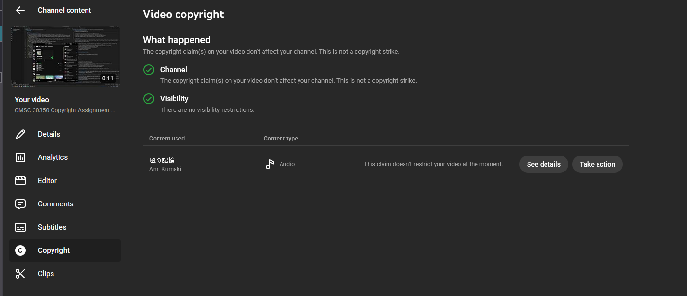
    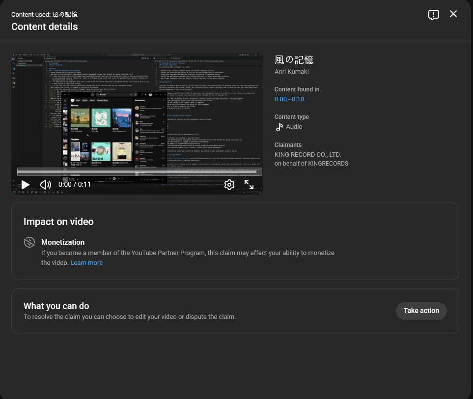
    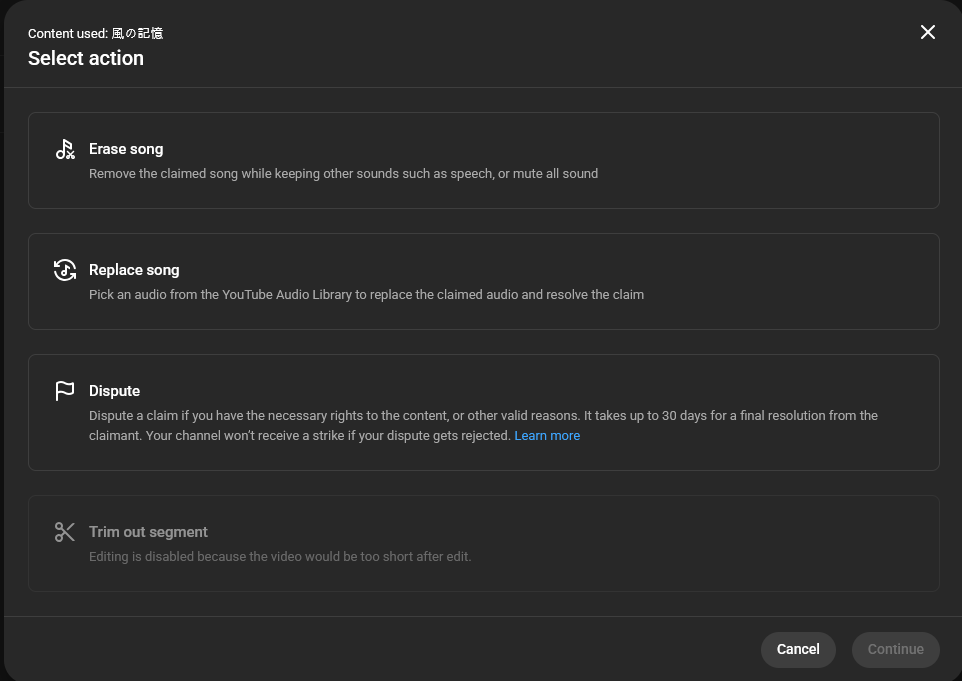
    - 90 sec clip - https://youtu.be/k70Rc48-Wb0 - Flagged instantly
    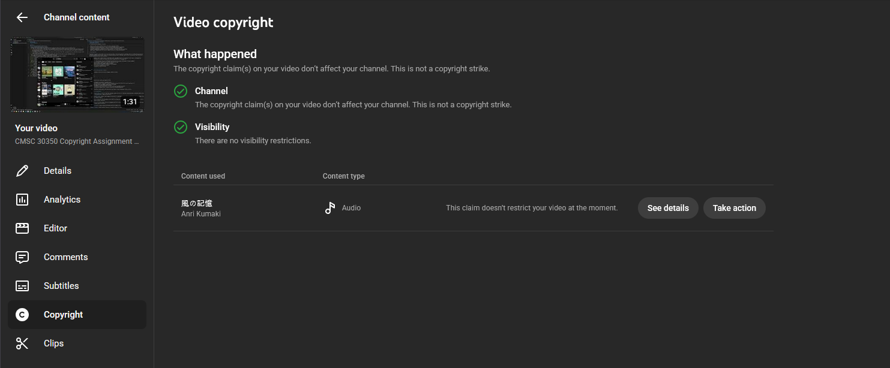
    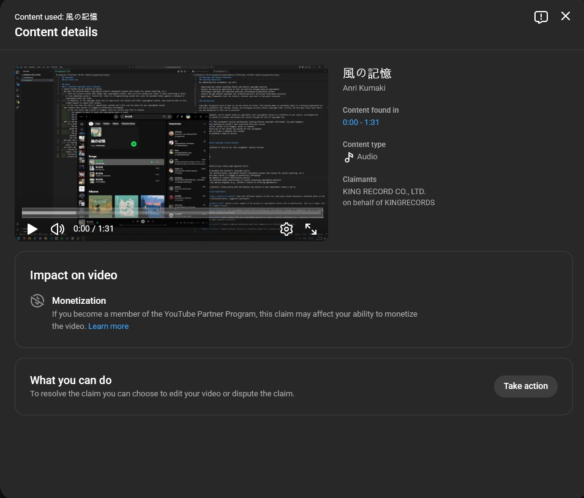
    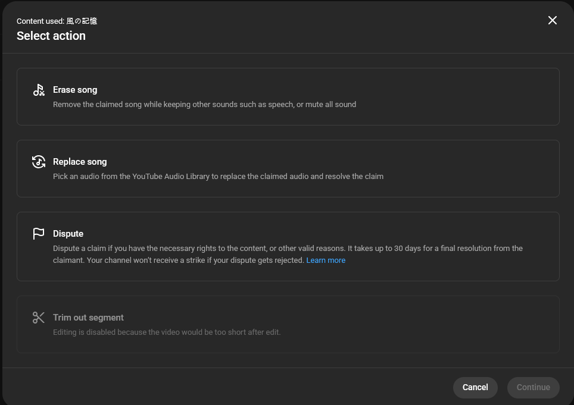
    - In both cases, there was only demonetization for the video. No mutes, no visibility restrictions. But, I have had previous cases where there were both issues with that, which suggests that it is dependent on the music company that holds the rights (also the song I took was released in 2006, so that might have something to do with that). In both cases, I couldn't select the trim out selection as it would make the video 0 seconds.
- Fair Use + Commentary
    - https://youtu.be/tJkbRng1l2k - Flagged instantly
    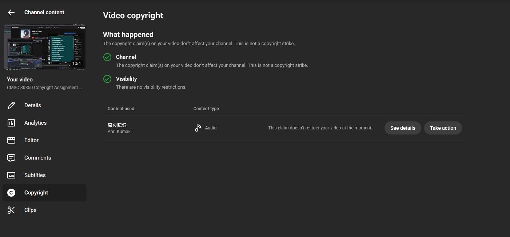
    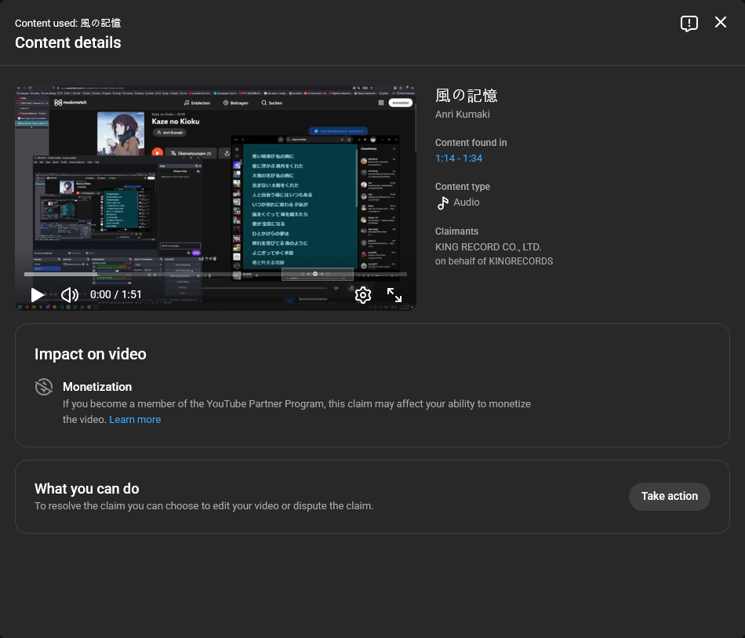
    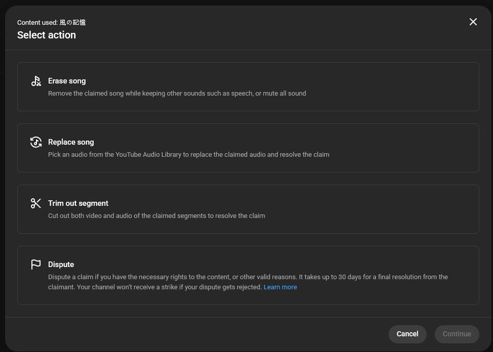
    - There was a part during the video, in which that I didn't have commentary over, as I had just explained what the song lyrics meant and then played the song to let the people here the song, and it seems that part was flagged, but not the earlier parts. I have the ability to dispute this time, if I have the proper rights to use it or other valid reasons such as fair use.

### 3. AI-Generated Content Investigation
- Direct Referenece
    - Prompt: ```Draw Aurelion Sol from League of Legends for me```
- Style Mimicry
    - Prompt: ```Draw something in the style of this (Copyrighted music video of Yorushika)```
    
    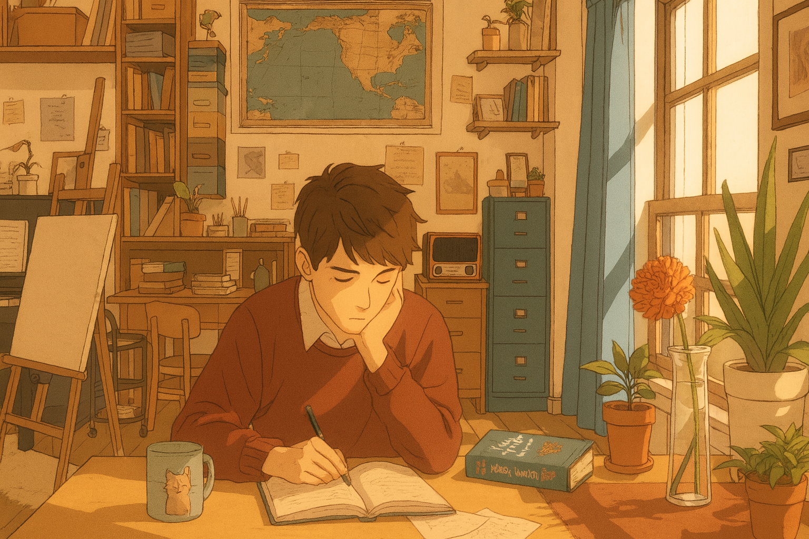
    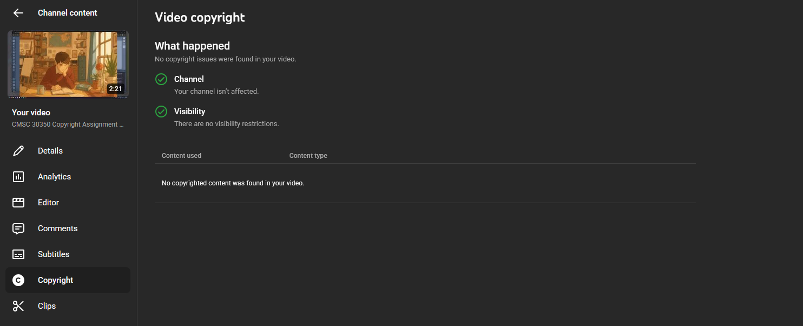
- Both were combined and uploaded to https://youtu.be/yqGK2voncLo
- Research Findings
    - Copyright Ownership of ChatGPT-Generated Content
        - According to OpenAI’s terms of service, users have the ownership of the content they generate using ChatGPT. However, under U.S. copyright law, the copyrightability of AI-generated content remains legally unsettled, as copyright traditionally requires human authorship. As a result, AI-generated works may receive limited or uncertain copyright protection.
    - YouTube’s Policy on AI-Generated Content
        - YouTube currently allows AI-generated content as long as it complies with platform policies related to copyright, impersonation, and misleading content. YouTube does not have a dedicated automated system for detecting AI-generated text or images. Copyright enforcement primarily relies on Content ID, which focuses on matching uploaded audio and video against known copyrighted media. As a result, AI-generated text and static visuals are generally not flagged unless they directly include copyrighted audio or video material.

### 4. Legal Analysis
- Part 2: 10sec, 90sec clips
    1. The raw song clips were nontransformative, i.e. no criticism, commentary, educational framing, etc.
    2. The nature of the copyrighted work is creative/expressive, so the courts tend to favour the owners of the music.
    3. 10 sec clip could have maybe have been short enough to be ok, but 90 seconds is definitely too long for it to constitute fair use.
    4. Uploading materials with portion of the song could harm the copyright holder's ability to monetize it.
- Part 2: Commentary over Copyrighted Music
    1. The commentary that I in the video was about the music, and directly speculating on the lyrical meanings.
    2. I extended the nature of the creative piece by adding on my own interpretation of it.
    3. I only analyzed a short segment of it.
    4. It would probably have minimal impact on the monetization of the song, as I am doing commentary on it. If anything, it would increase it, encouraging them to listen to it.
- Part 3: AI-Generated Content
    - Refer to Section 3, Research Findings

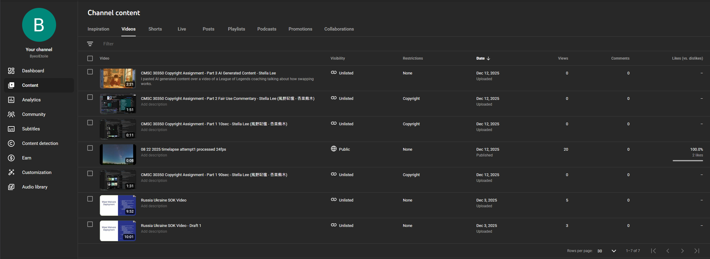